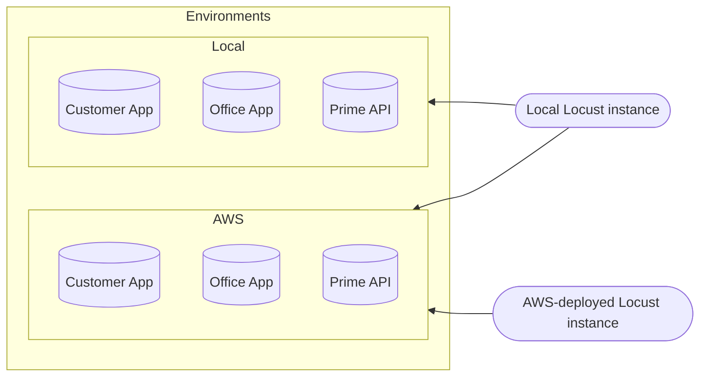

# Running Load Tests

There are several ways you can run load tests. You can run `locust` locally or use the deployed version (on AWS). You
can also use a local `mymove` server or the one deployed in the load test environment (on `loadtest.dp3.us`). One thing
to note is that you can't point the deployed `locust` instance at a local `mymove` server.

### Visualization of possible Locust combinations

## UI vs Command Line

`locust` can be run either via the command line or through the web UI provided by `locust`.

If you run `locust` locally, you have the option of using either, but if you run `locust` from AWS, you will only have
the option of running with the UI.

The instructions in these docs will cover how to get `locust` started (with or without the UI), but won't cover much
about the UI since the [locust web interface docs](https://docs.locust.io/en/stable/quickstart.html#locust-s-web-interface)
cover a decent amount of helpful information.

## Setup and Running

There are different instructions based on where `locust` is running from so follow the instructions below based on what
you're trying to do:

* [Running Locust Locally](./running-locust-locally)
  * This is regardless of whether you are targeting either a local or the load test env `mymove` server
* [Running Locust From AWS](./running-locust-from-aws.md)
