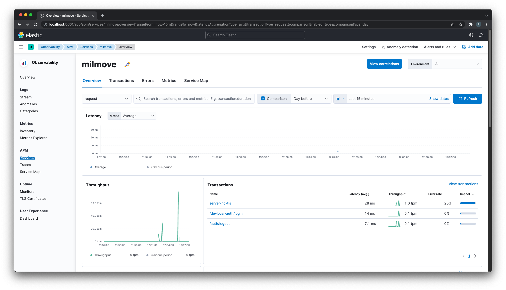

# Running telemetry locally

Because we are using open telemetry, we can use one telemetry system
in production (AWS) and another one locally. More information on why open telemetry was chosen is available in this [ADR](https://github.com/transcom/mymove/blob/6feaa5b79cfd20276dd670babdbf0b31351a2fb4/docs/adr/0061-use-opentelemetry-for-distributed-tracing.md).

Running the elastic search offering locally turns out to be easy.

## Setup

1. In one terminal window run `docker-compose -f docker-compose.telemetry.yml up`

  You may see an error message like: `ERROR: for apm-server  Container "4aa42b9f5715" is unhealthy` or `ERROR: for apm-server  Container "4aa42b9f5715" is unhealthy` this may be an indication that docker doesn't have enough memory. To resolve this issue open up Docker Desktop. Click the gear icon in the header as shown below:

  

  You can then click `Resources` on the left nav bar and modify the `Memory` slider to `8.00 GB`. Click `Apply & Restart`. Once you have done this rerun the original command.
  
  

1. In another, run `TELEMETRY_ENDPOINT=localhost:55680 TELEMETRY_ENABLED=1 make server_run`

1. Visit <http://localhost:5601>

  

1. To start collecting information you must run the mymove app locally. To do this navigate to the mymove repo and run the command `make client_run` to start up the local server. You can then navigate through the app to start collecting data.

1. To view this data, on the Kibana page you can click the `Observability` panel and then navigate to the `APM` -> `Services` section on the left hand navigation bar.

  

  Note: Services are all named `unknown_service_milmove_gin` and all local transactions besides logging in and logging out are called `server-no-tls`. This is a known [bug](https://dp3.atlassian.net/browse/MB-9926).

## Troubleshooting

If you see the following error `context deadline exceeded` this is an indication that it can't reach the telemetry server.
